Ecowave is an innovative app designed for fashion designers and suppliers to promote eco-friendly material choices in their collections.

Leveraging AI, users can interact with the app to discover sustainable alternatives to traditional materials.

The app also provides an inventory management feature, allowing users to track materials and assess their environmental impact, including water usage, CO2 emissions, and electricity consumption.

Additionally, users can create and manage upcoming projects or collections, selecting and organizing their preferred eco-friendly materials.

See screenshots in development below;

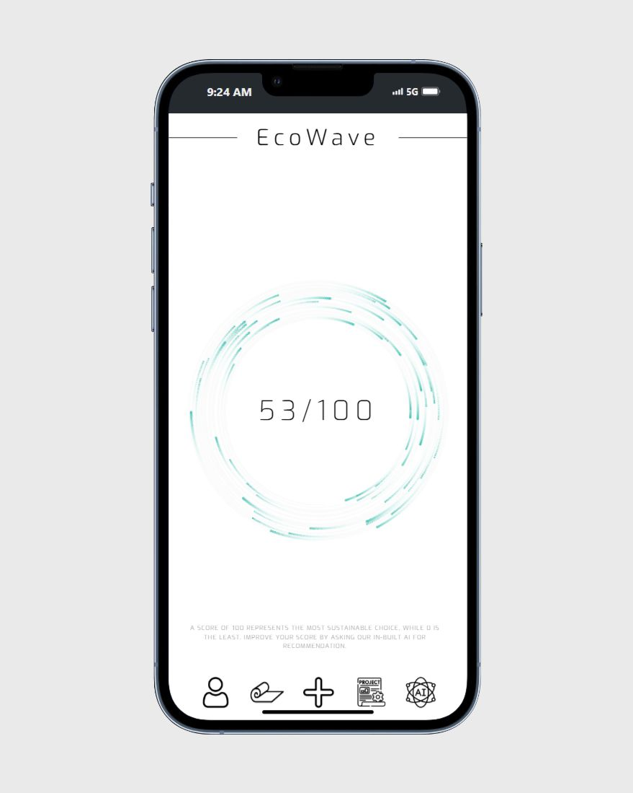
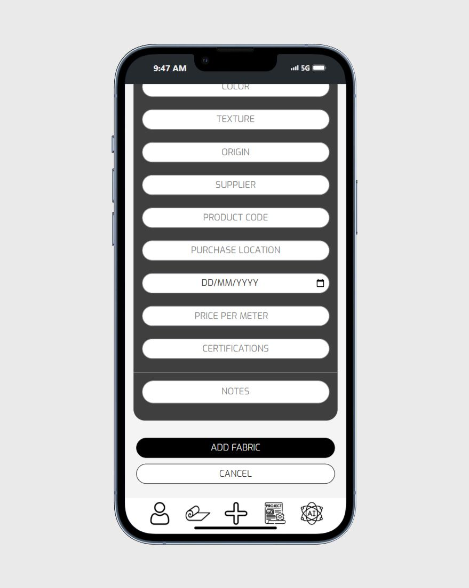
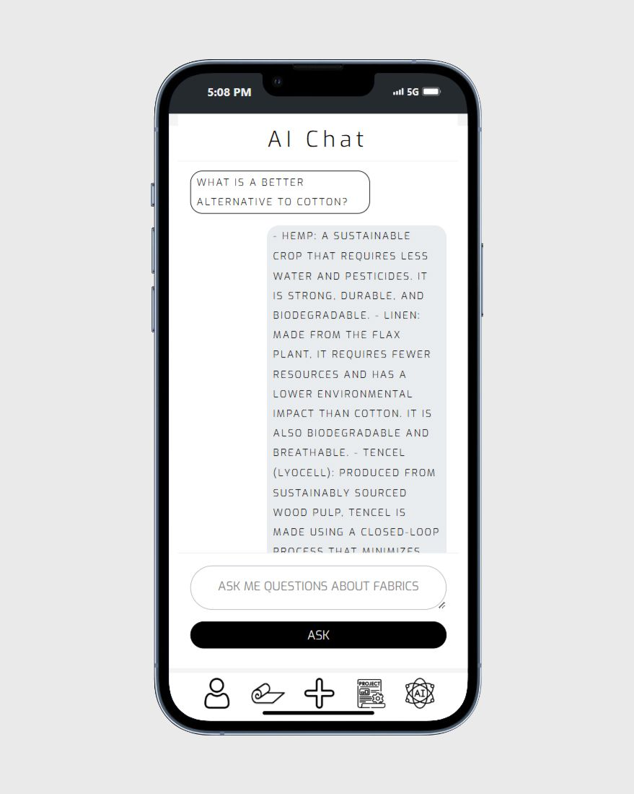
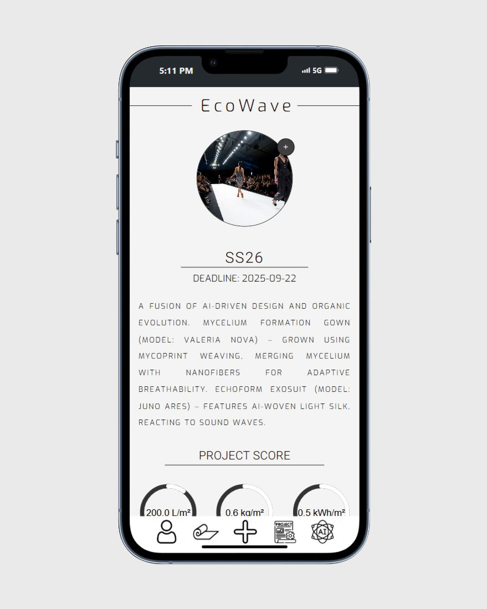
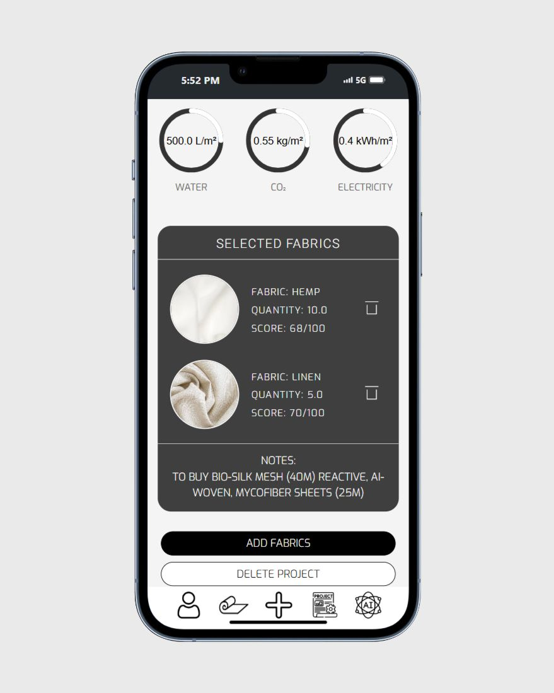
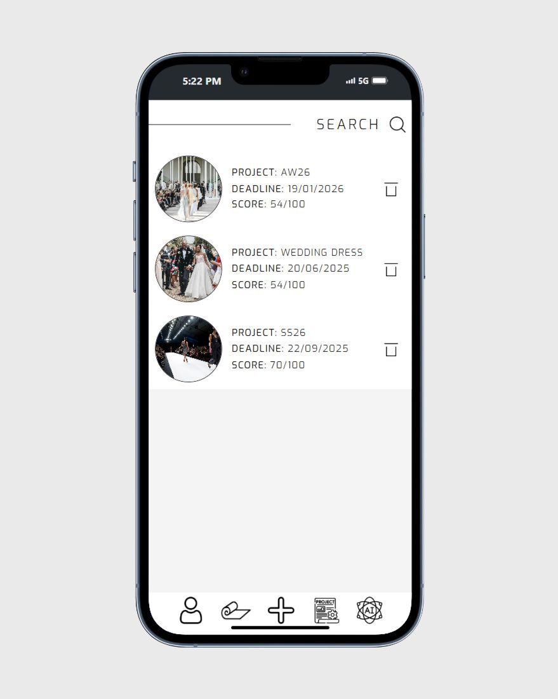
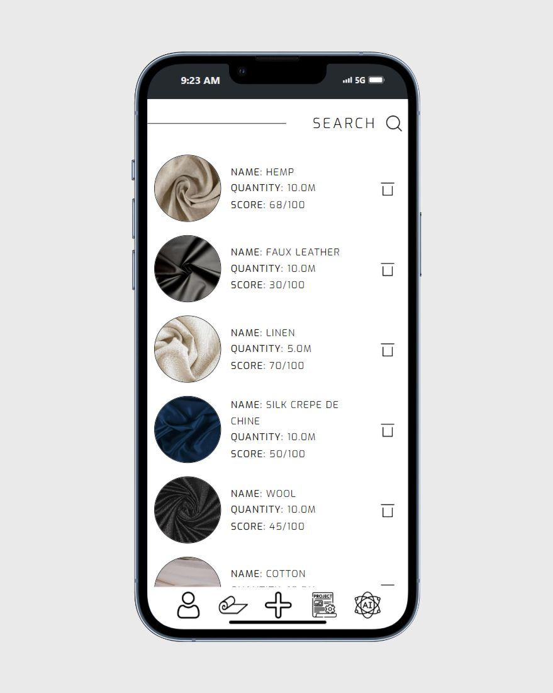
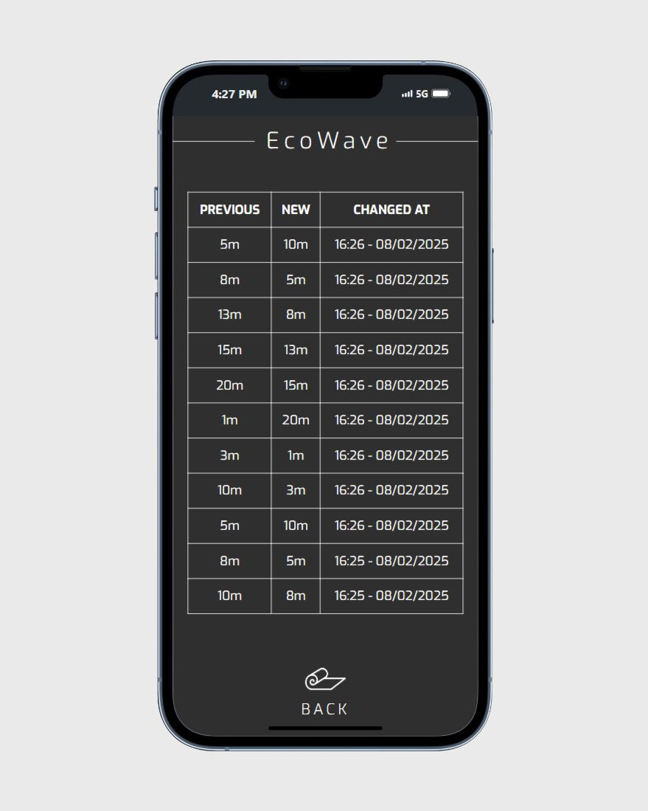
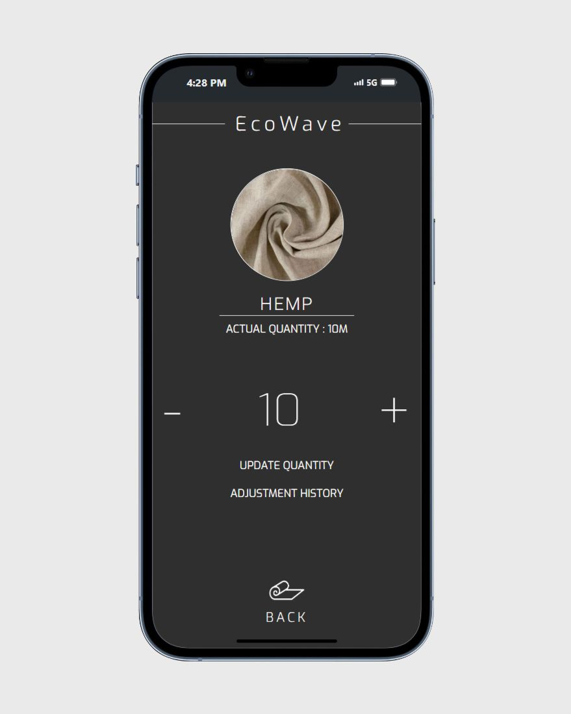
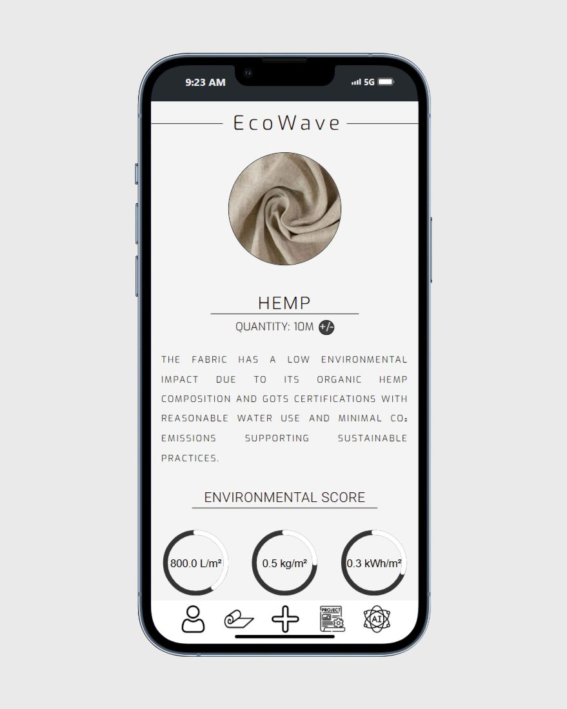
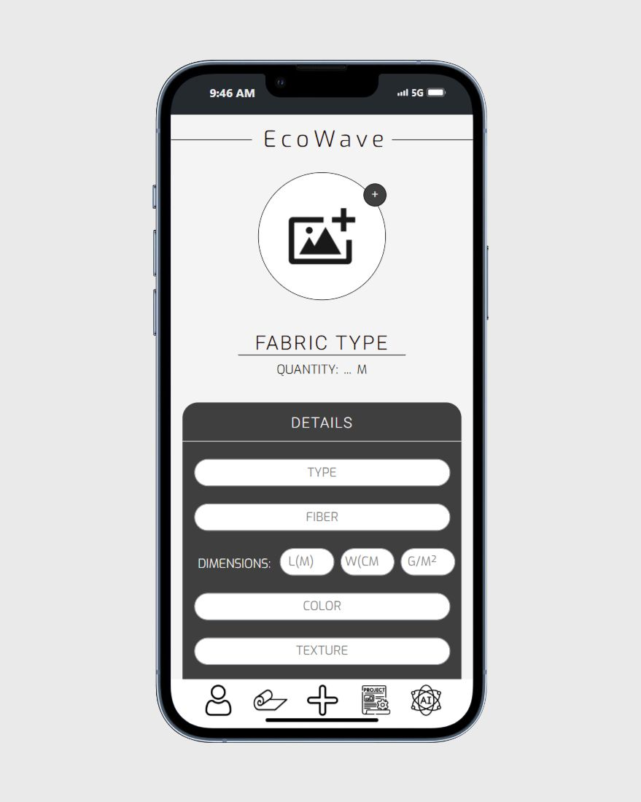
